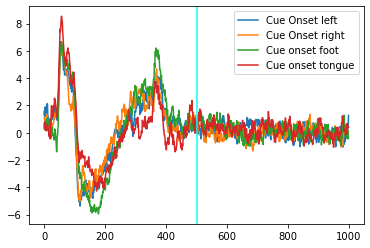
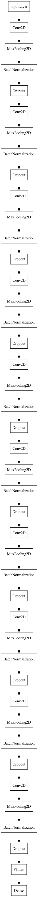
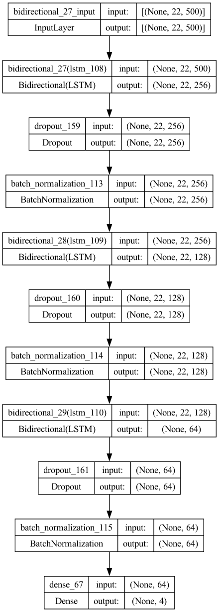
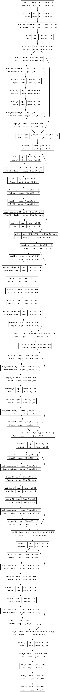

# ECE147-Research Project

Our research concerns EEG signal processing for human brain waves using CNN and RNN models for action classification. 
We compare performance of CNNs and RNNs to LSTMs using F1 score as a metric for classifcation quality.

Research Paper: [Deep Learning For Decoding of Brain Signals on the Human EEG](https://drive.google.com/file/d/14NE2_KY8IA6PcPQ0zYl6kqTLhWK3iRHW/view?usp=sharing) 

Arxiv Pre-print: [Survey of CNN and Post-CNN Models For Decoding of Human EEG Data](https://drive.google.com/file/d/1AaAh4jNYIS8A8_9bTv3GlmKaNuTCbsoP/view?usp=sharing)

# The Dataset

# Model Architectures

We propose several model architectures including an vanilla CNN, LSTM, and CNN-LSTM fusion model described more in depth within our paper. 

CNN Model  

LSTM Model  
[LSTM Model Architecture](./Gallery/LSTM_architecture.png)

ConvLSTM  

EEG-ResNet  

# Future Directions

* We implement EEG signal generation using a GAN architecture and assess artificial EEG generation performance using our existing classification models. 
